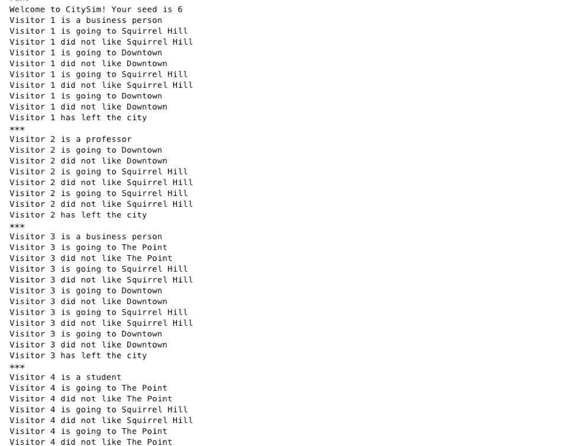
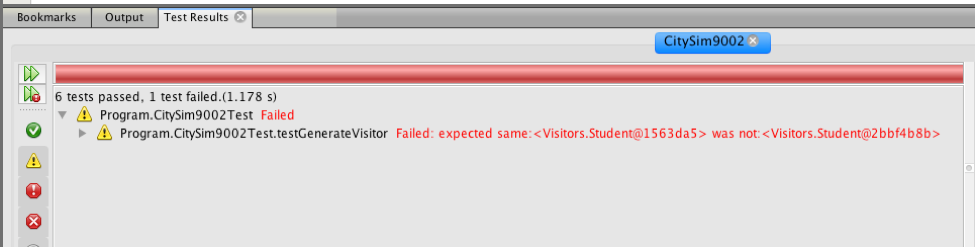
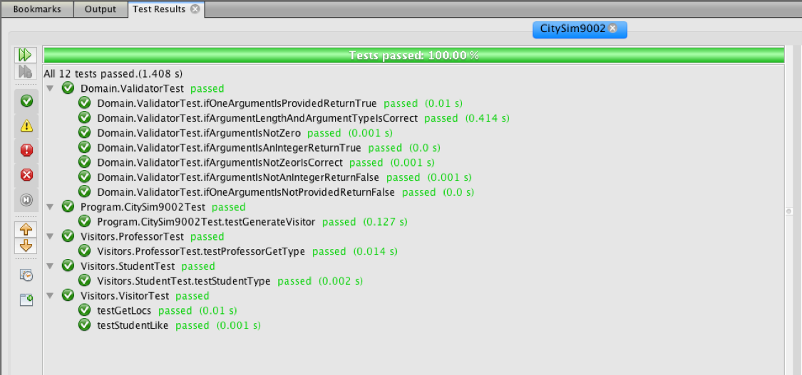

#IS2545 - DELIVERABLE 2: Unit Testing
### Wang pittID:siw20
***
**1. The challenge for this project**

1 Use Object Oriented Design
  * I designed two classes
  * Citylocations used to store general location info
  * Visitor class and its subclasses used to build the four kind of visitors

2 Write testable code
  * It is very challenging to write method that return a value I can test on.
  * I am not used to TDD. Usually I write the code directly, but writing test before code is difficult for me.

3 Testing
  * Stubbing is more difficult for me.
***

  
  ***
  

  

